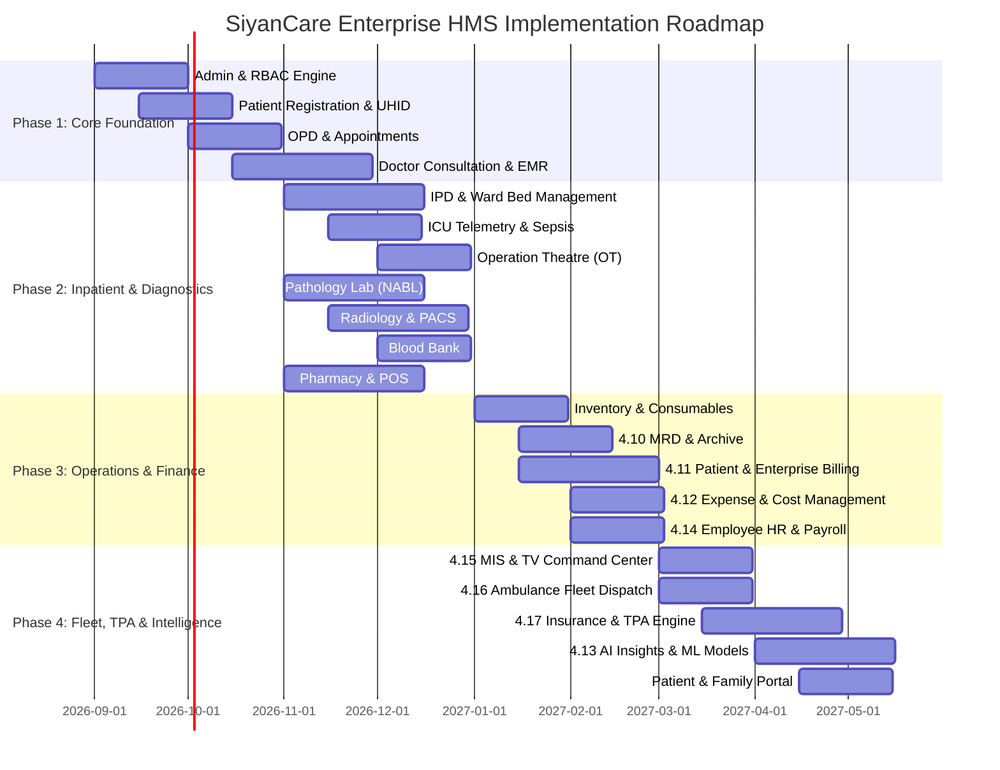

# 🗺️ SiyanCare HMS Implementation Roadmap & Execution Strategy

This document outlines the multi-phase deployment roadmap for SiyanCare Enterprise HMS. It details the sequential dependency path alongside explicit **Parallel Track Execution** guidelines for engineering teams building clinical, operational, financial, and AI modules concurrently.

---

## 📈 Phased Implementation Overview

---

## ⚡ Phase Breakdown & Parallel Execution Matrix

### 🚀 Phase 1: Core Foundation & Outpatient Care (Month 1 - Month 2.5)
* **Goal**: Establish core system security, RBAC permissions, master data schemas, patient registration, and outpatient physician consultations.
* **Modules Implemented**:
  1. **System Administration & RBAC Engine** (`AdminModule.tsx`)
  2. **Patient Registration & Reception** (`RegistrationModule.tsx`)
  3. **OPD & Appointment Management** (`AppointmentsModule.tsx`)
  4. **Doctor Consultation & EMR** (`ConsultationModule.tsx`)
* **Parallel Execution Opportunities**:
  * ⚡ **Squad A (Security & Admin)** can build the `Admin & RBAC Engine` while **Squad B (Clinical UX)** builds `Patient Registration` and `OPD Queue`.
  * ⚡ `Doctor Consultation EMR` schema design can proceed in parallel once the base `UHID` data model is locked.

---

### 🏥 Phase 2: Inpatient Care, Critical Suites & Diagnostics (Month 3 - Month 4.5)
* **Goal**: Expand into full inpatient bed management, critical care ICUs, operating theatres, and diagnostic laboratory engines.
* **Modules Implemented**:
  1. **IPD & Ward Bed Management** (`WardsModule.tsx`)
  2. **ICU & Telemetry Suite** (`IcuModule.tsx`)
  3. **Operation Theatre (OT) & Anaesthesia** (`OtModule.tsx`)
  4. **Pathology & Clinical Laboratory (NABL)** (`PathologyModule.tsx`)
  5. **Radiology & PACS Imaging** (`RadiologyModule.tsx`)
  6. **Blood Bank & Component Registry** (`BloodBankModule.tsx`)
  7. **Pharmacy & Point of Sale (POS)** (`PharmacyModule.tsx`)
  8. **Vaccination & Immunization** (`VaccinationModule.tsx`)

* **Parallel Execution Opportunities**:
  * ⚡ **Squad 1 (Inpatient & Surgical)**: Builds `IPD Ward Beds`, `ICU Telemetry`, and `OT Suite` simultaneously as they share the bed/room master database.
  * ⚡ **Squad 2 (Diagnostics & Blood Bank)**: Operates 100% independently building `Pathology (NABL)`, `Radiology PACS`, and `Blood Bank` using decoupled diagnostic order API interfaces.
  * ⚡ **Squad 3 (Pharmacy & Retail POS)**: Builds `Pharmacy POS` and `Vaccination Tracking` independently, interfacing with inventory batch tables.

---

### 💳 Phase 3: Enterprise Operations, HR & Financials (Month 5 - Month 6)
* **Goal**: Automate financial reconciliation, medical records archiving, supply chain procurement, and workforce payroll.
* **Modules Implemented**:
  1. **Inventory & Medical Consumables Supply Chain** (`InventoryModule.tsx`)
  2. **4.10 Medical Records Department (MRD)** (`MrdModule.tsx`)
  3. **4.11 Patient & Enterprise Billing** (`BillingModule.tsx`)
  4. **4.12 Expense & Cost Management** (`ExpenseModule.tsx`)
  5. **4.14 Employee HR & Payroll** (`EmployeeModule.tsx`)

* **Parallel Execution Opportunities**:
  * ⚡ **Squad Finance**: Builds `4.11 Billing Engine` and `4.12 Expense Management` concurrently using shared financial ledger schemas.
  * ⚡ **Squad HR & Operations**: Builds `4.14 Employee HR & Payroll` and `4.10 MRD Archiving` in parallel without any dependencies on financial calculation engines.
  * ⚡ **Squad Supply Chain**: Builds `Inventory & Procurement` alongside `Pharmacy Batch Management`.

---

### 🛡️ Phase 4: Fleet Dispatch, TPA Insurance & AI Intelligence (Month 6.5 - Month 8)
* **Goal**: Deploy emergency transport networks, national health scheme integration, predictive AI models, and patient portals.
* **Modules Implemented**:
  1. **4.15 MIS Reporting & Live Command Center** (`MisReportingModule.tsx`)
  2. **4.16 Ambulance & Emergency Fleet Dispatch** (`AmbulanceModule.tsx`)
  3. **4.17 Insurance & TPA Management Engine** (`InsuranceModule.tsx`)
  4. **4.13 AI Insights & Predictive Intelligence** (`AiInsightsModule.tsx`)
  5. **Patient & Family Portal** (`PortalModule.tsx`)

* **Parallel Execution Opportunities**:
  * ⚡ **Squad Emergency & Logistics**: Builds `4.16 Ambulance Dispatch` with live Google Maps GPS tracking.
  * ⚡ **Squad Insurance & Government Schemes**: Builds `4.17 Insurance & TPA Engine` (Ayushman Bharat PMJAY, CGHS, Cashless Pre-Auth).
  * ⚡ **Squad Data Science & AI**: Trains and integrates `4.13 AI Predictive Models` (Sepsis early detection, readmission risk, diet generator) over historical data warehouses.
  * ⚡ **Squad Analytics & Portals**: Builds `4.15 MIS TV Command Center` and `Patient Self-Service Portal` concurrently.

---

## 🔀 Parallel Implementation Capability Matrix

| Module | Dependent On | Can Implement In Parallel With |
| :--- | :--- | :--- |
| **Pathology & Radiology** | Registration (UHID) | IPD, Pharmacy, HR, Expense, Ambulance |
| **Pharmacy & POS** | Inventory Schema | ICU, OT, MRD, HR, TPA Insurance |
| **Employee HR & Payroll** | Admin RBAC | All Clinical, Diagnostic & Billing Modules |
| **Ambulance & Fleet** | Patient Master | MIS Reporting, TPA Insurance, AI Models |
| **Insurance & TPA** | Billing Schemas | Ambulance Dispatch, Patient Portal, HR |
| **4.13 AI Insights** | Historical Data Schemas | MIS Command Center, Fleet, Patient Portal |
